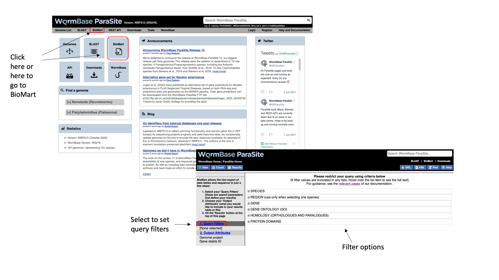
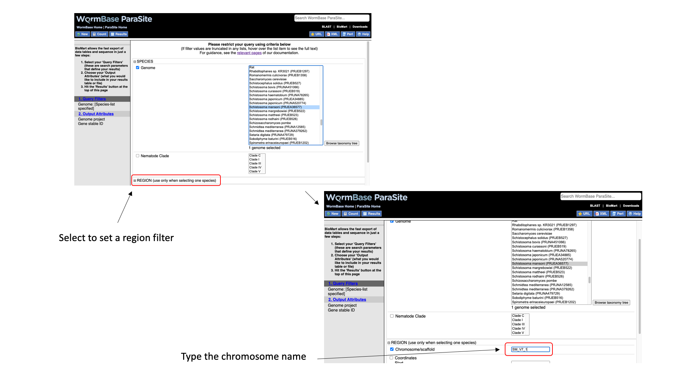
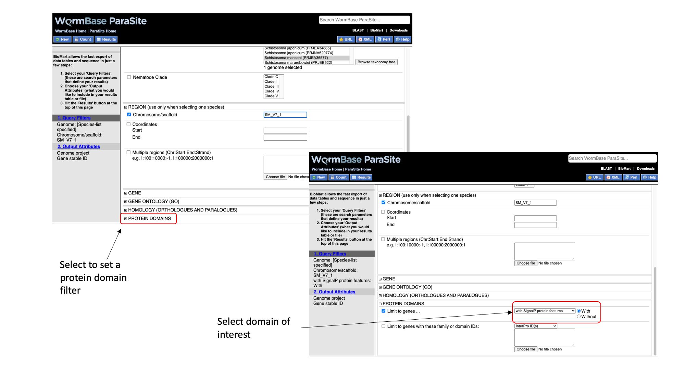
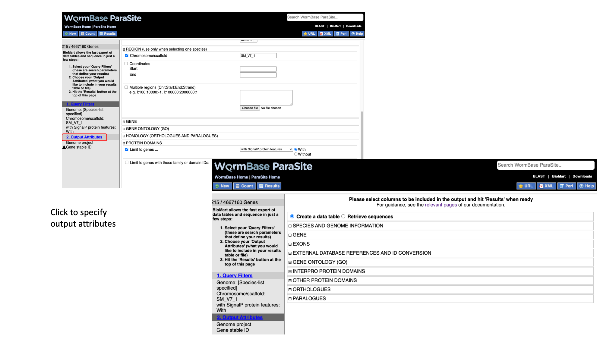
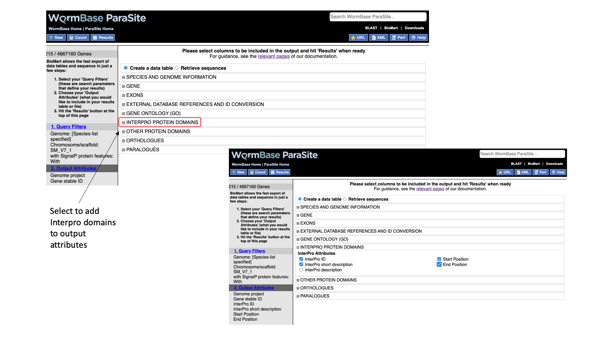
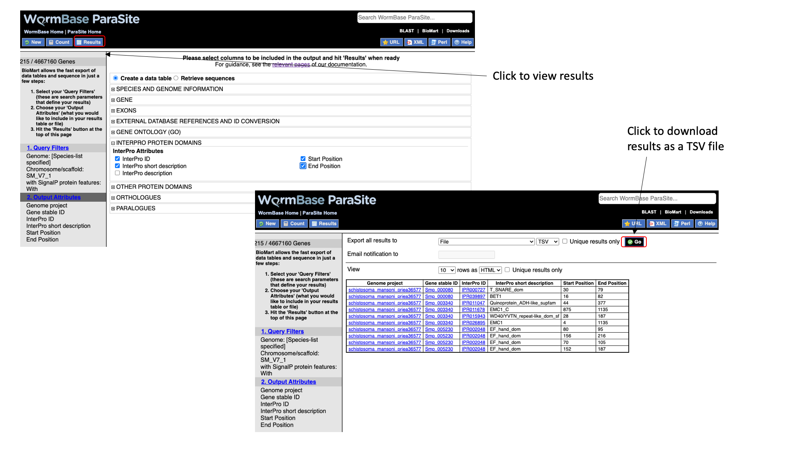

## BioMart <a name="biomart"></a>

BioMart is an extremely powerful tool that allows you to query WormBase ParaSite data in bulk, with no programming knowledge. Consider all the information that we gather by clicking around the gene page. Now imagine that rather than having one gene of interest, we actually have a list of 100 genes. That would be a lot of clicking around on gene pages! BioMart allows you to output all of this data for multiple genes in a few clicks.

Retrieving data for a list of known genes isn’t the only thing that BioMart can do. In this section, we’ll go through a series of examples and exercises that aim to illustrate the power of this tool. 

There are two main steps involved in building a BioMart query. Firstly, a set of criteria are defined which the genes, transcripts, or proteins must conform to in order to be included in the results. These are referred to as *Query Filters*. Secondly, the data-types to include in the output list are defined. These are Output Attributes. Some of the *filters* allow you to enter data to filter on, e.g. a list of gene names. By way of example: if you wanted to obtain the genomic locations of a list of genes that were of interest to you, you would provide the list of gene names in the *Query Filters*, and denote that you want to see genomic locations in the *Output Attributes*.  The table below lists some examples of filters and attributes for BioMart queries.

| Examples  of Filters       | Examples of Attributes           | 
| ------------- |-------------| 
| A genome      | Gene, transcript or protein IDs | 
| A genomic region | Sequences      |
| A list of gene IDs| Identifiers from external databases (eg, Uniprot IDs)      |
| All genes that have GO term x, or protein domain Y| Protein domains or GO terms associated with a gene ID    |
| All genes that have GO term x, or protein domain Y| IDs of orthologous genes, % identity   | 

Query Filters and Output attributes can be combined to produce more complex queries and customised output; for example: you might want to retrieve the IDs and predicted protein domains of all of the genes from _Schistosoma mansoni_ chromosome 1 that have a predicted signal peptide. We’ll walk through this example to get started.

* From the WormBase ParaSite homepage, select BioMart from the tool bar, or the BioMart icon.



We have to set three Query Filters: the genome (the _S. mansoni_ genome), genomic location (chromosome 1), and a protein domain (genes whose protein product have a predicted signal peptide).

* Select “Species”, tick the “genome” checkbox and scroll down to select “Schistosoma mansoni (PRJEA36577)”.


* Select “Region”, tick the “Chromosome/scaffold” check box and type “Sm_V7_1” into the text field (you must know the exact name of the chromosome).



* Select “Protein domains”, tick the “Limit to genes...” checkbox and select “with SignalP protein features”



Note that as we have built up the query, the filters have appeared on the left hand side of the page.

* Click “count” to count the number of genes in the database that fulfil these filter criteria.


Next we will select the output attributes. “Genome project” and “Gene stable ID” are already pre-selected as attributes.

* Select “Output attributes”



BioMart lets us generate two types of output: data tables, and sequence (FASTA) files. In this example we’ll be generating a data table. We want to retrieve the gene IDs and associated protein domains of the 215 genes that fulfil our filter criteria.

* Select “Interpro protein domains” and check the tick boxes for “InterPro ID”, “InterPro short description”, “Start position” and “End position”.



* Click “Results” to see a preview of your results table. The full results table can be downloaded by selecting the file type you’d like to download and clicking “Go”.



[↥ **Back to top**](#top)

#### BioMart exercise <a name="biomart_exercise"></a>

Using the following _S. ratti_  gene names to answer questions 1-5:

```
SRAE_1000001600
SRAE_1000001700
SRAE_1000001800
SRAE_1000001900
SRAE_1000002000
SRAE_1000002100
SRAE_1000002200
SRAE_1000002300
SRAE_1000002400
SRAE_1000002500
```

1. Retrieve their WormBase gene IDs and UniProtKB/TrEMBL IDs.
2. Retrieve the InterPro domains that they have been annotated with (InterPro short description). [Q: why do some of the output rows appear multiple times?]
3. Retrieve the gene stable IDs of their _Strongyloides stercoralis_ orthologues. [Q: which gene has more than one _S. stercoralis_ orthologue?].
4. Retrieve the names of any GO terms associated with the genes. 
5. Retrieve a FASTA file of their peptide sequences.

Use the following _S. mansoni_ gene stable IDs to answer questions 6 and 7:

```
Smp_000090 
Smp_000120 
Smp_000180 
Smp_000210 
Smp_000220 
Smp_000250 
Smp_000330 
Smp_000380 
Smp_000400 
Smp_000520 
Smp_000030 
Smp_000040
Smp_000050 
Smp_000070 
Smp_000080 
Smp_000130 
Smp_000140 
Smp_000150 
Smp_000160 
Smp_000170 
Smp_000320 
Smp_001085 
Smp_002080 
Smp_002180 
Smp_002550 
Smp_000020 
Smp_000075 
Smp_000100 
Smp_000110 
Smp_000370
```
6. How many of these genes have orthologues in _S. haematobium_? Generate a table that has the gene stable ID for the homologue in both species, the homology type (1-1, 1-many, etc), and the % identity between the two orthologues. Of these genes, how many also do not have a human orthologue?
7. Retrieve (a) a FASTA file with the CDS sequence of each transcript encoded by these genes. Make sure that the transcript stable ID is in the header; and (b) a FASTA file containing the CDS sequence plus 100 nt downstream of the stop codon of each of those transcripts. In the header, include the transcript stable ID and the name of the scaffold that the transcript is on.

8. Generate a table containing all of the protein coding genes on _Brugia malayi_ scaffold Bm_007. The table should have their gene stable IDs and start and end coordinates. For genes that have paralogue(s), include the stable ID, coordinates and scaffold of the paralogue(s).
Export a list of the paralogues, and perform a new query to generate a table that maps each paralogue stable ID to its UniProt/TrEMBL ID.
9. Retrieve a list of _Onchocerca volvulus_ genes that are annotated with the GO term “reproduction” (or any of its child terms). In the output, include the IDs and short descriptions of the InterPro protein domains associated with the genes.
10. How many worm pseudogenes are annotated in WBPS? Which worm genomes have annotated pseudogenes?

[↥ **Back to top**](#top)
